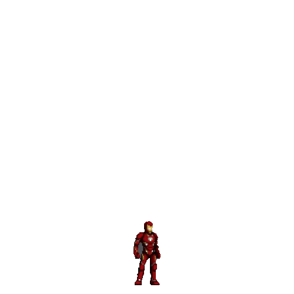

###

<h1 align="left">👩‍💻 About Me</h1>

Hey! I'm Jimena, a passionate developer from 🇵🇾 Paraguay. - Mechatronics Engineering student at Universidad del Cono Sur de las Américas. - I love robotics and learning by doing!

<h2 align="left">🧪 Technologies I'm Exploring</h2>

###
              

 - I'm actively building solo and team-based projects to grow my portfolio. - Focused on logic, real-world applications and creative tools.

###

<h2 align="left">💡 My Developer Mindset</h2>

- I believe in collaborative learning to tackle challenges while having fun.  - Always open to exploring new tech with creativity, discipline, and resilience

###

<h2 align="left">🚀 Projects</h2>

  <strong>🎧 <a href="https://github.com/351jimenavel/Hackathon-_404_NF">MoodWave</a></strong> AI-powered mood-based playlist generator. Hackathon winner! 
  <strong>💬 <a href="https://github.com/351jimenavel/-3---Chat-Socket---The-Huddle">Chat en Red</a></strong> Real-time terminal chat with sockets, threading, and selectors. 
  <strong>🧭 <a href="https://github.com/351jimenavel/-2---OOP-Calculadora-de-Rutas---The-Huddle">Calculadora de Rutas</a></strong> Pathfinding visualizer using BFS in a 2D grid. 
  <strong>🌀 <a href="https://github.com/351jimenavel/-2--Laberinto-DFS---The-Dive">Laberinto Maestro</a></strong> C++ maze generator and solver using DFS.

